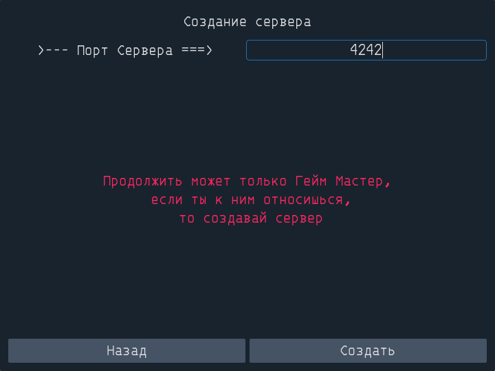
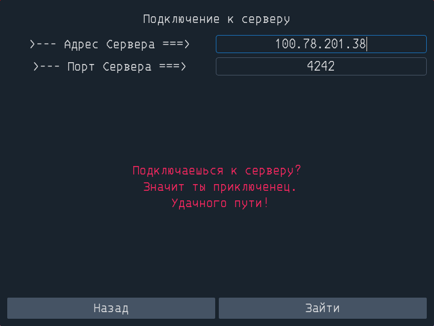
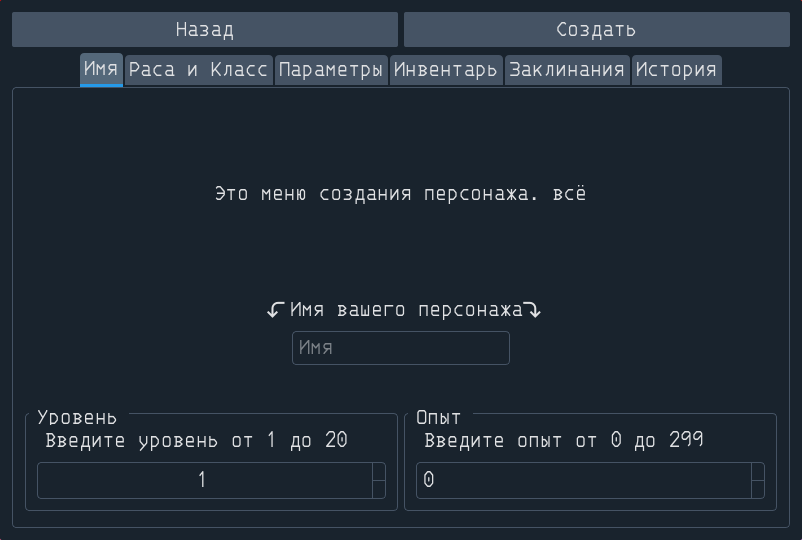
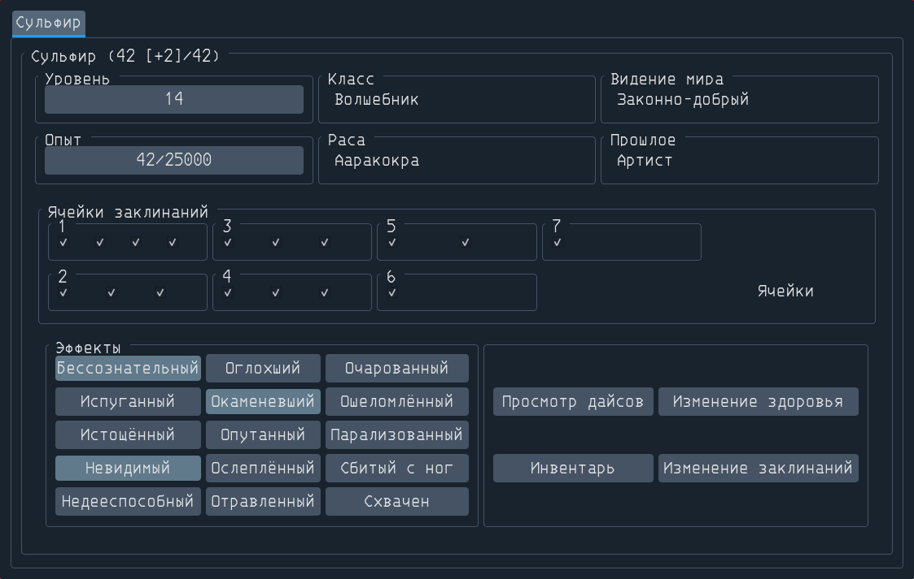

# DND-Manager

Мой первый проект на Python в котором я пытался писать на ООП. Если будут какие-то замечания, по поводу структуры кода, то буду рад их услышать.
## Возможности приложения

### Реализованные

- Создание лобби для подключения игроков по IP (в роли ДМ-а)

- Подключение игроков к лобби по IP (в роли игрока)

- Создание и редактирование персонажей:
    - Имя
    - Уровень, опыт
    - Класс
    - Раса
    - Прошлое (пока что только текст, никак не влияет на характеристики)
    - Мировоззрение
    - Характеристики (сила, ловкость, телосложение, харизма, интеллект, мудрость) можно нарандомить, можно вписать вручную, учитывая количество очков(27 на все характеристики)
    - Изменение хитов можно нарандомить, можно вписать вручную, можно брать среднее значение от дайса hp
    - Предметы инвентаря (взятые с [dnd.su](https://dnd.su)):
      - [Магические Предметы](https://dnd.su/items/)
      - [Предметы Сумки гиганта](https://dnd.su/articles/inventory/492-giant-bags/)
      - [Безделушки](https://dnd.su/articles/inventory/75-trinkets/) только PHB
      - [Яды](https://dnd.su/articles/inventory/148-poisons/)
      - [Препараты](https://dnd.su/articles/inventory/149-drugs-and-substances/)
    - Заклинания (взятые с [dnd.su](https://dnd.su/spells/))
    - Прописание истории персонажа

#### Карточка персонажа
Открывается при подключении к лобби
У игрока такая же, но без выбора игрока сверху

- Изменение уровня
- Изменение опыта
- Изменение количества ячеек заклинаний
- Изменение эффектов, наложенных на персонажа
- Просмотр характеристик (силы, ловкости, телосложения, харизмы, интеллекта, мудрости)
- Изменение здоровья
- Добавление/удаление предметов из инвентаря
- Добавление/удаление заклинаний

__Пока что подключение только напрямую по ip адресу. Если в разных локальных сетях, то придется использовать белый IP или эмулятор локальной сети.__

### Будут реализованы в будущем:
- Добавление заклинаний по HomeBrew
- Добавление предметов по HomeBrew
- Изменение характеристик персонажа во время игры
- Влияние характеристик персонажа на максимальное количество заклинаний(у волшебника и подобных классов)
- Изменение хитов здоровья не по числам во время игры (на случайное значение, по дайсу, или на среднее значение дайса)
- Попытка подключения к серверу не только в пределах локальной сети
